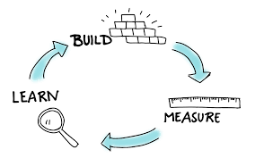

Before we began on our journey to build a new digital native savings pillar for the Private Bank, there was a a nailed on assumption that we would be building a shiny new app for our new clients to interact with. 
In previous carnations, if the view of the [highest paid persons view](https://whatis.techtarget.com/definition/HiPPOs-highest-paid-persons-opinions) was "_We’re building an app…_" we’d be building an app :-)

## Market research, user testing and rapid prototyping backs up subjective views with data

The team assembled has a bias for data driven decision making. Money was well spent with market research company who identified our target market being 35+. This demographic, although tech savvy, still do a significant amount of their internet banking via online / website. <insert data point to support this>. The research also shows that people tend to use the computer / laptop when making significant bank transfers <insert data point here>.

>The screen real-estate is also a significant factor when clients want to move larger sums of money (our >minimum balance 
>is set to be 5k). [A study by PwC Australia](https://www.finextra.com/blogposting/7923/mobile-vs-desktop-based-online-banking)
>backs up this assertion. Their report stated >52% of baby boomers would not use a mobile phone for online banking because they
>prefer bigger screens for these activities.

The first week with the team in place involved everyone working [rapidly prototyping](https://medium.com/inside-design/what-is-rapid-prototyping-c94657d133aa) a product with a crude app that we could hit the high street with to get some feedback from potential future clients.
The sample set of people we interacted with gave feedback consistent with the harris survey. We also had a number of people highlighting a drop-off point when we had asked them to install an app on their phone. People were uncomfortable installing an app on their phone that provides only savings product.

## MVP doesn’t mean never!

We are looking to take the lead from the likes of Nutmeg and Marcus from Goldman Sachs who both delayed the launch of their apps until well after their official launch to market.
The team have a huge amount of work to get through in order to hit our target of a mid-2020 launch. Maximising the work we don’t do to achieve that outcome gives us every chance of achieving this.

